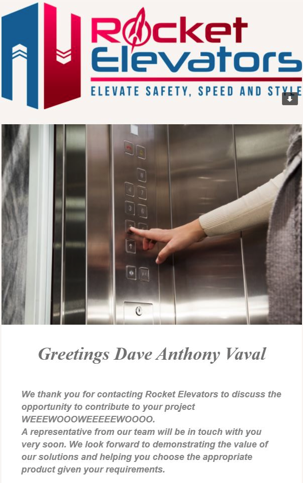
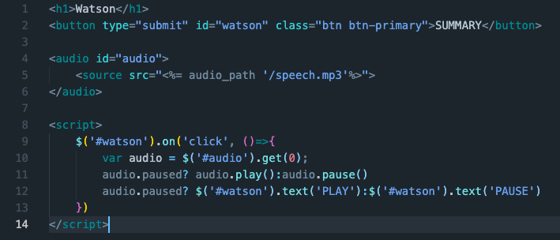
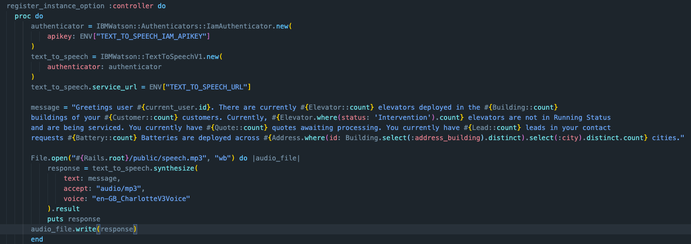
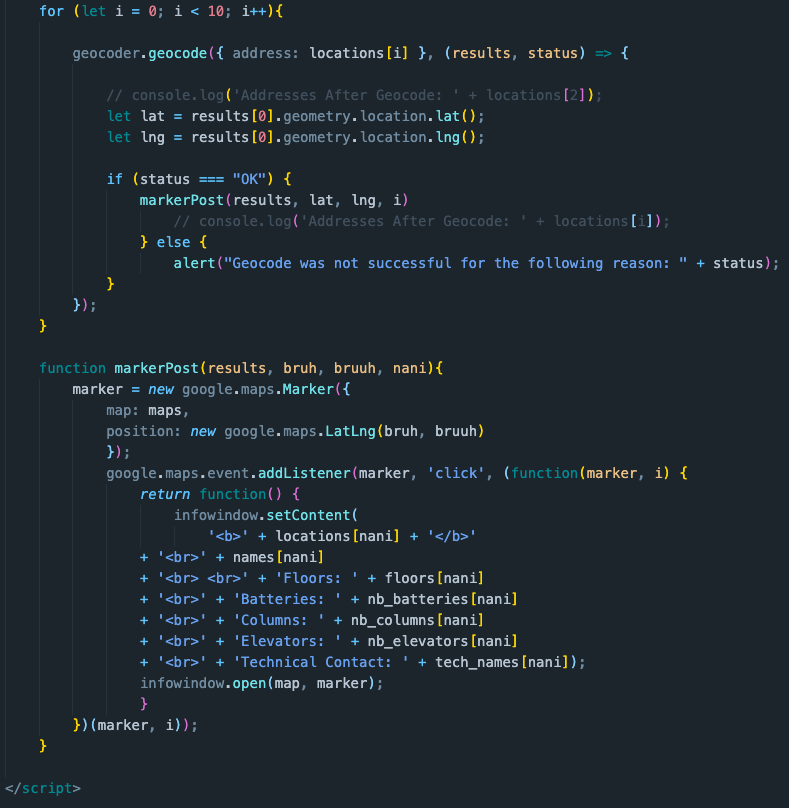
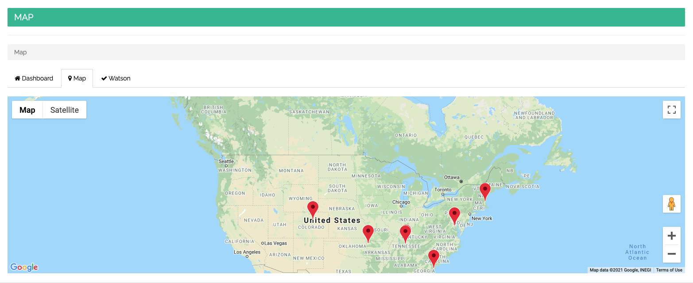
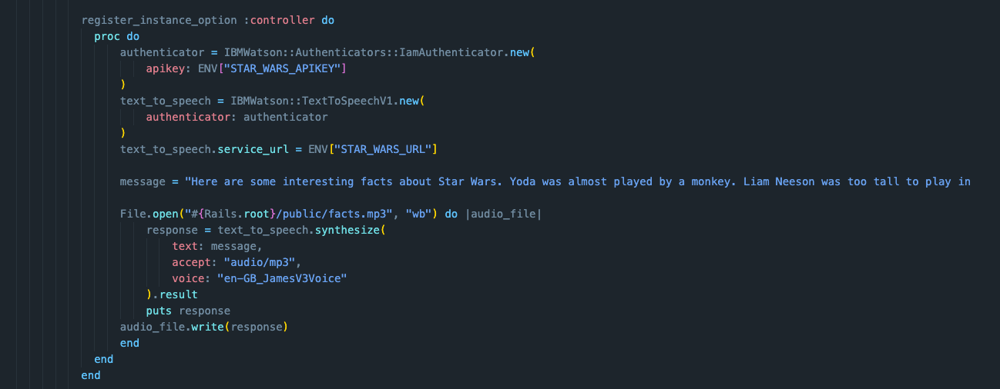
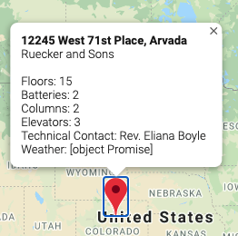
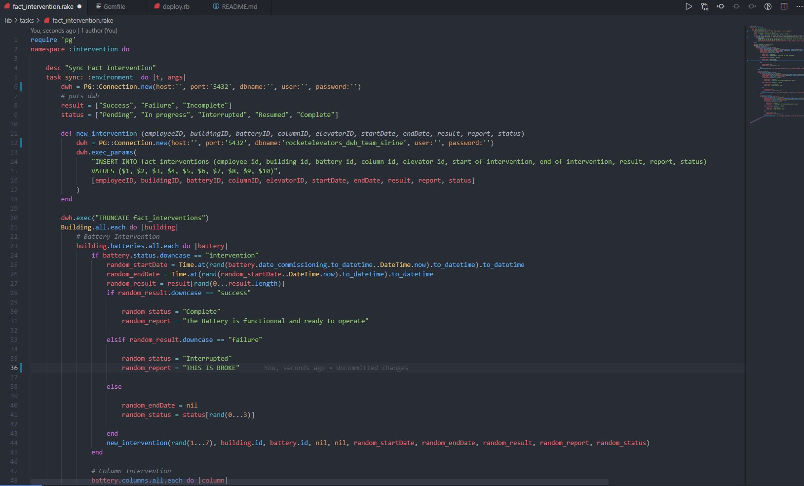

# Rocket Elevators Information System #

<i>CLICK TO EXPAND</i>

This week converted our static website into a Ruby on Rails application.

The first step was to use the Assett Pipeline to provide the JS, CSS and HTML files needed to run the website. 

We implemented Embeded Ruby Syntax to the HTML code.

We created a database which contained multiple tables :

The employee table is used to assign permissions to access the Backoffice. It is also used to store e-mails and passwords of said employees.

If you want to access the Backoffice use these credentials:

- username: nicolas.genest@codeboxx.biz
- password: newdog1

 

 

The users table is used to store login information for employees. It also assigns an ID to each one in order to link the tables together.

 

In order to create a Backoffice, we first had to implement an authentication process. To achieve this, we used Gem Devise which took care of all the controllers necessary for user creation and user sessions. We then used RailsAdmin that provided us with a Backoffice interface for managing our data, such as the Employee table, the Users table and a Quote table which is used to store all the quote requests made on the website.

 

Here is a screenshot of what the list of quotes looks like :

 

We then deployed the website to AWS Ubuntu Server using Cloudflare to secure it.

 
 

The Backoffice was updated to include more data from Mysql as well as adding a Data Warehouse.

 

It is now possible to Query the database and show the results in a graph :

 

We can also group multiple Graphs at the same time using a Dashboard :

 

In order to link the two databases together and to keep them up to date, we had to create tasks :

----------------------------------------------------------------------------------------------------------------
 

# Rocket Elevators APIs #

<i>CLICK TO EXPAND</i>

**Use these credentials to access the back office:**

- Username: nicolas.genest@codeboxx.biz
- Password: newdog1
---------------------------------------------------------------------------------------------------------------
 

<u><b>This week we had to implement APIs to our Rocket Elevators Rails Applications:</u></b>

 

First we added the **Twilio** and **Slack** APIs which were pretty similar. We added this code to the *Elevator Model*:

 

Next we linked the *Quotes* and *Leads* controller to **Zendesk**:

 

Here is what the **Sendgrid** code looks like in the *Leads Controller*:

This is the email that the customer receives when he/she completes the *Contact Form*:

 

In order to have *Contact Form Attachment Files* sent to **Dropbox**,(Le login est cmoutlook17@gmail.com password: rocketelevators2021) here is what we added:

 

Next comes **IBM Watson Text-to-Speech**. We started by adding an audio player to *Rails Admin* in a new tab called Watson:

Then, we created a method that updates the audio file with Watson reading the text provided, here is the code:

See what the audio player looks like:

 

Finally, we implemented **Google Maps** in the *Back Office*. This is the code:

Here is what it looks like on the website:

## BONUS ##

 

We added a **Spotify Player** to the *Admin Page*:

 

Next, we added a new **Watson** to provide interesting facts about *Star Wars*:

 

Finally we tried to add **Weather** to *Google Maps* but this is as far as we got:

# Extented Data Warehouse #

<u><b>This week we had to extend our data warehouse with a table named Fact Intervention:</u></b>

 

Then we developed a rake task to generate random data into that table.

# week 9 :fondation  #

 
PART A
 
1- A new interventions table is added to the mysql database
 
2- An intervention form is added to the web site. 
 
The form can be accessed after login. The intervention link appears after contact menu  
 
The form consists on an evolutionary path. After each choice another appears 
 
3- The save action implies : 
  (a) insert the intervention filled data in the DB
  (b) create a zendesk ticket 
 
PART B 
1- A .net Rest Apis interventions for Rocket Elevators is created.
Below the 3 defined links which can be consumed using postman 
 
Git Repository:   git@github.com:ayadisirine/Rest_conso.git
 
Azure deployment: https://sirinerocketelevatorsrestapi.azurewebsites.net/
 
--WS1--
  Method : GET
  Link https://sirinerocketelevatorsrestapi.azurewebsites.net/api/interventions/Pending  
  Scoop: to get all the interventions that do not have a start date and are in "Pending" status.
   
--WS2--
  Method: PUT
  Link: https://sirinerocketelevatorsrestapi.azurewebsites.net/api/interventions/inprogress/{id}
  Example: https://sirinerocketelevatorsrestapi.azurewebsites.net/api/interventions/inprogress/4 
  Scoop: to make the intervention status to InProgress, and set a staring date, and time
   
--WS3--
  Method: PUT
  Link: https://sirinerocketelevatorsrestapi.azurewebsites.net/api/interventions/completed/{id}
  Example: https://sirinerocketelevatorsrestapi.azurewebsites.net/api/interventions/completed/4 
  Scoop: to make the intervention status Completed, and set en ending date, and time
   

